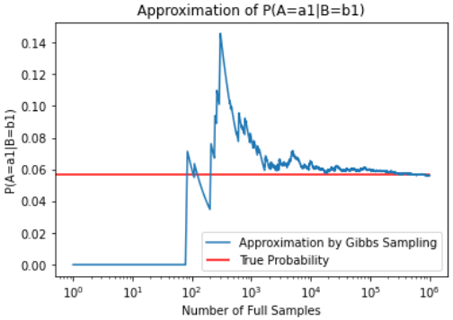

# Advanced-AI
⛓ Projects and notes from CPSC 422: Advanced AI

## Contents:
- `Partially-Observable-MDP.ipynb`: Programatically computing belief states given actions/observations in a Partially Observable Markov Decision Process (POMDP)
- `Approximate-Reasoning-Belief-Networks.ipynb`: Approximate inference in belief networks using rejection sampling and likelihood weighting
- `Undirected-Graphical-Models.ipynb`: Implementing Gibbs Sampling for approximate inference in Markov Networks
- `WalkSAT.ipynb`: Exploring difficulty of satisfiability problems using WalkSAT
    - `walkstat.sh`: Shell script to run WalkSAT in batches and extract data from each run
- `Parse-Trees-Probabilistic-Context-Free-Grammar.ipynb`: Generating probabilistic context-free grammar from a corpus using Natural Language Toolkit (NLTK)

Credits to Professor Giuseppe Carenini for creating these projects, and guiding my understanding of Artificial Intelligence. Link to original course website [here](https://www.cs.ubc.ca/~carenini/TEACHING/CPSC422-21/index.html).
