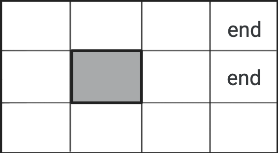

# Advanced-AI
⛓ Projects and notes from CPSC 422: Advanced AI

## Contents (so far):
- `Partially-Observable-MDP.ipynb`: Computing belief states given actions and observations in a Partially Observable Markov Decision Process (POMDP)
- `Approximate-Reasoning-Belief-Networks.ipynb`: Approximate inference in belief networks using rejection sampling and likelihood weighting

Credits to Professor Giuseppe Carenini for creating these projects, and guiding my understanding of Artificial Intelligence. Link to original course website [here](https://www.cs.ubc.ca/~carenini/TEACHING/CPSC422-21/index.html).
